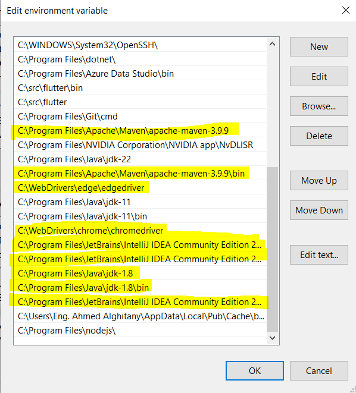
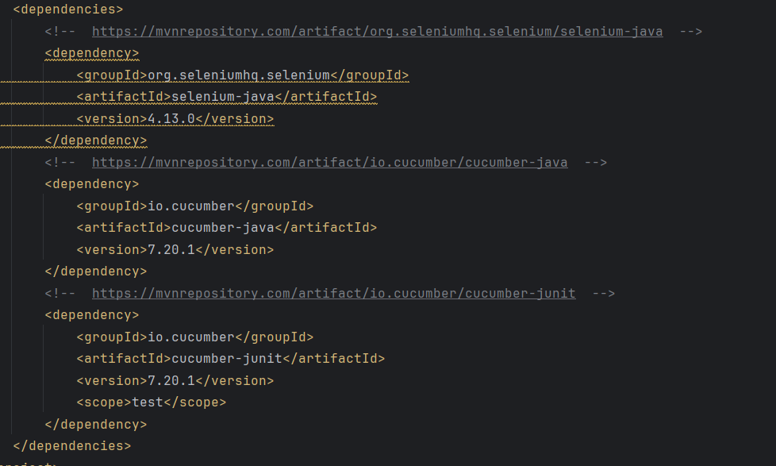

<h3>
  <strong>Selenium Maven Project for E-commerce App Testing</strong>
</h3>
<ul>
  <li>
    <strong>Project Overview</strong>
  </li>
  <li><strong>Setup and Configuration</strong>
<ul>
  <li>Maven Project Creation</li>
  <li>Dependencies</li>
  <li>BDD Framework Structure</li>
</ul>
  </li>
  <li><strong>Test Scenarios and Automation</strong>
    <ul>
      <li>Test Scenarios</li>
      <li>Automated Steps</li>
    </ul>
  </li>
  <li><strong>Execution and Reporting</strong></li>
  <li><strong>Screenshots and Proof</strong></li>
  <li><strong>How to Run the Project</strong></li>
  <li><strong>License</strong></li>
</ul>

<h3><strong>1. Project Overview</strong></h3>

This section describes the project as an automation framework built for an e-commerce application using:

<ul>
  <li>Selenium for UI testing.</li><li>Maven for dependency management.</li>
  <li>Page Object Model (POM) for maintainability.</li>
  <li>Behavior-Driven Development (BDD) with Cucumber.</li>
</ul>

<h3><strong>2. Setup and Configuration</strong></h3>
<h4><strong>Maven Project Creation</strong></h4>
<ul>
  <li>Includes instructions on setting up Maven and Java environment variables (<code>JAVA_HOME</code>, <code>MAVEN_HOME</code>, etc.).</li>
  <li>Verifications using terminal commands: <code>java -version</code> and <code>mvn -v</code>.</li>
  <li>Mentions screenshots:<ul><li>Environment variables.</li>
    <li>Maven external libraries in IntelliJ IDEA.</li>
    <li>Maven project settings in IntelliJ IDEA.</li>
  </ul>
  </li>
</ul>

<h4><strong>Dependencies</strong></h4>
<ul>
  <li>Dependencies added to <code>pom.xml</code>:<ol>
    <li>Latest Selenium Automation Framework.</li>
    <li>TestNG or JUnit for assertions.</li>
    <li>Cucumber for BDD.</li></ol></li>
  <li>Mentions a screenshot showing the selected versions from the Maven repository.</li>
</ul>

<h4><strong>BDD Framework Structure</strong></h4>
<ul>
  <li>Explains directory creation (<code>src/test/java</code>, <code>src/test/resources</code>).</li>
  <li>Lists required plugins installed in IntelliJ IDEA (e.g., Cucumber for Java).</li>
  <li>Includes a screenshot of installed IntelliJ plugins.</li>
</ul>

<h3><strong>3. Test Scenarios and Automation</strong></h3>
<h4><strong>Test Scenarios</strong></h4>
<ul>
  <li>Feature files created for functionalities in <code>src/test/resources</code>.</li>
  <li>Each feature file includes test scenarios for the e-commerce app.</li>
</ul>
<h4><strong>Automated Steps</strong></h4>
<ul>
  <li>Steps automated with:<ul><li>WebDriver open/close methods.</li>
    <li>Step definitions for each scenario.</li><li>Assertions for expected results.</li>
  </ul>
  </li>
</ul>

<h3><strong>4. Execution and Reporting</strong></h3>
<ul>
  <li>The test suite is executed using a Test Runner.</li>
  <li>Maven commands are used to run the tests.</li>
  <li>Reports generated:<ul><li>HTML report.</li>
    <li>JSON report.</li><li>JUnit XML report.</li>
  </ul>
  </li>
</ul>

<h3><strong>5. Screenshots and Proof</strong></h3>

Screenshots listed in a <code>screenshots/</code> directory:

<ul>
  <li>Environment variables.</li>
  <li>Maven external libraries.</li>
  <li>Maven project settings.</li>
  <li>Dependency versions from Maven repository.</li>
  <li>IntelliJ plugins.</li>
</ul>

<h3><strong>6. How to Run the Project</strong></h3>

Steps to execute:

<ol>
  <li>Clone the repository using <code>git clone https://github.com/your-repo-name.git</code>.</li>
  <li>Open the project in IntelliJ IDEA.</li><li>Run the tests using <code>mvn test</code>.</li>
  <li>View the reports in the <code>target</code> directory.</li>
</ol>

<h3><strong>7. License</strong></h3>

Mentions the project is licensed under MIT License.

<h3><strong>Preview Example</strong></h3>

If rendered in a browser, the page will have:

<ul>
  <li><strong>Headings</strong> (<code>&lt;h1&gt;</code>, <code>&lt;h2&gt;</code>, etc.) for a clear hierarchy.</li>
  <li>An <strong>ordered list</strong> for the table of contents.</li>
  <li><strong>Bullet points</strong> for steps and lists.</li>
  <li>Inline code blocks styled with <code>&lt;code&gt;</code> for commands and file paths.</li>
  <li>Screenshots referenced by their filenames.</li>
</ul>

<h3><strong>Visual Style</strong></h3>
<ul>
  <li><strong>Plain white background</strong> (default browser styling).</li>
  <li><strong>Black text</strong> with blue hyperlinks for links like Maven repository and license information.</li>
  <li>Sections separated with headings for readability.</li>
</ul>

You can preview it by saving the HTML file and opening it in any browser like Chrome, Firefox, or Edge. It will look neat and professional. If you want further styling, you can add a CSS file to make it visually appealing.

